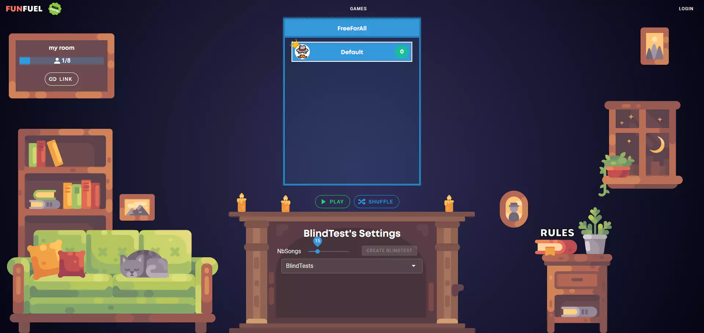
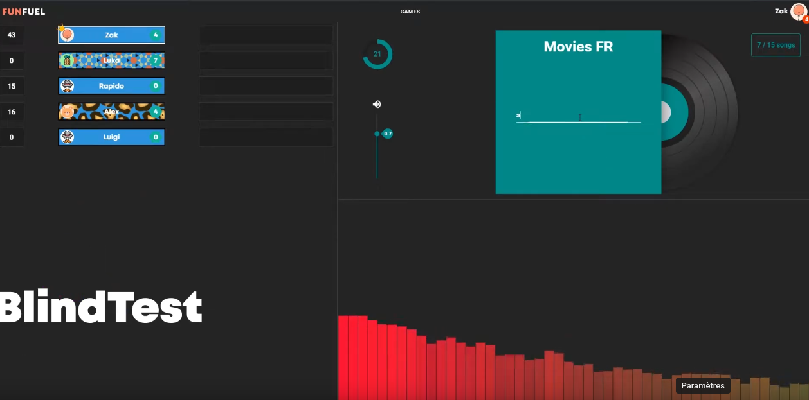
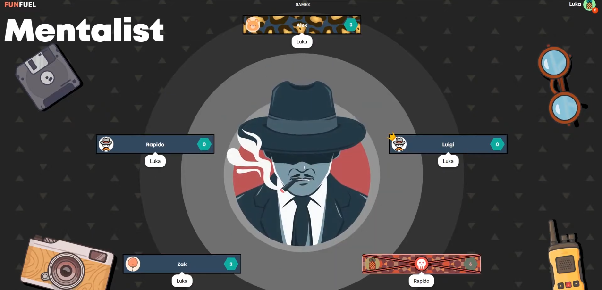

# 

FunFuel is a plateform for in browser games

(The website is no longer hosted)

# Trailer 📹

A video trailer can be found [here](https://www.youtube.com/watch?v=sQbmNIm49LQ)

# Screenshots 🖼

# Games 🎮

The plateform currently has two games:

 - Mentalist (Also known as Undercover or Mr White)
 - A blindTest (Blind tests a created by the community using youtube video links, the blindtest are moderated)

# Technos 📚

Front: VueJs Vuex Vuetify 

Back: Typescript Express.js websockets Postgresql AmazonS3 Prometheus Grafana

Architecture: Microservices

# Kickstarter 💰

This is a fun duo project. We tried to do a kickstarter as you can see in the trailer. Unfortunately it did not reach it's goal.